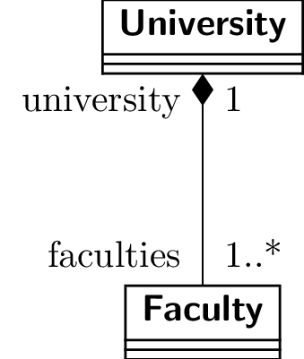

# UML Diagrams

The following is a collection of UML diagrams to remind myself how to use them.

Feel free to use this as a reference yourself.

The document is current a work in progress.

## Relationships

### Composition

This is read as:
- A University object has one or more Faculty objects, accessible through the faculties association.
- A Faculty object is a part of University object, accessible through the university association.

Note that the multiplicity of 1 is not necessary to be specified, as this is always 1 for a composition.

### Aggregation

This is read as:
- A Company object has one or more Person objects, accessible through the employees association.
- A Person object is aggregated in zero or more Company objects, accessible through the emplyer association.
