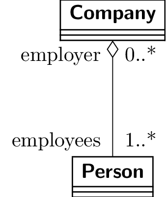

# UML Diagrams

The following is a collection of UML diagrams to remind myself how to use them.

Feel free to use this as a reference yourself.

The document is current a work in progress.

## Relationships

### Composition

### Aggregation

